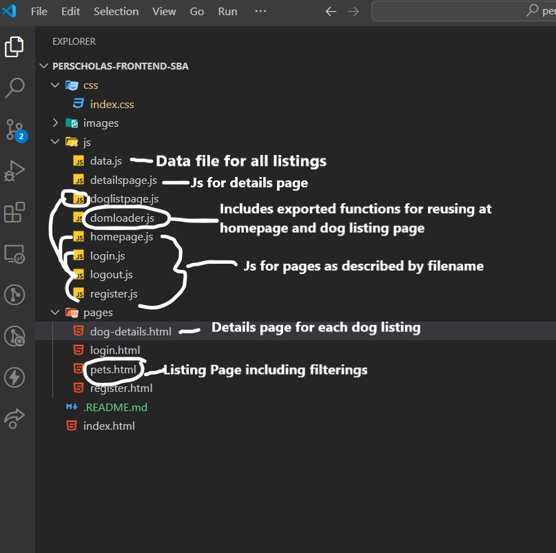
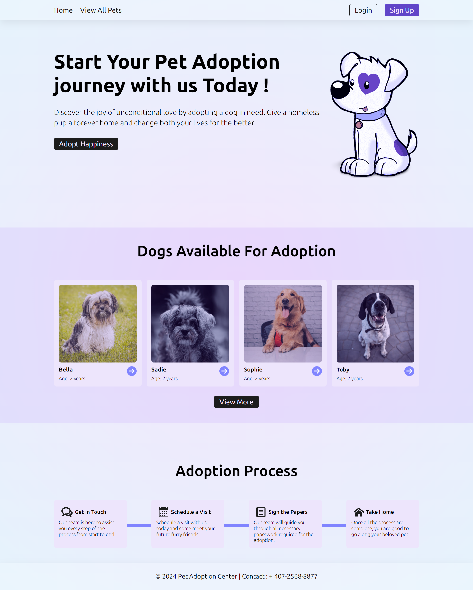
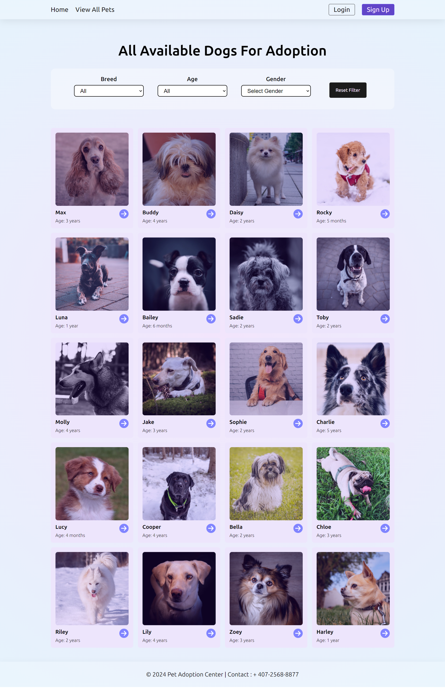
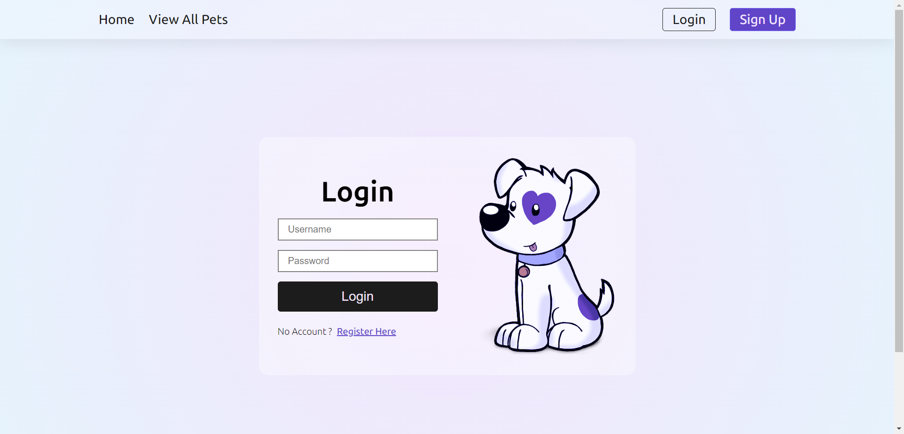
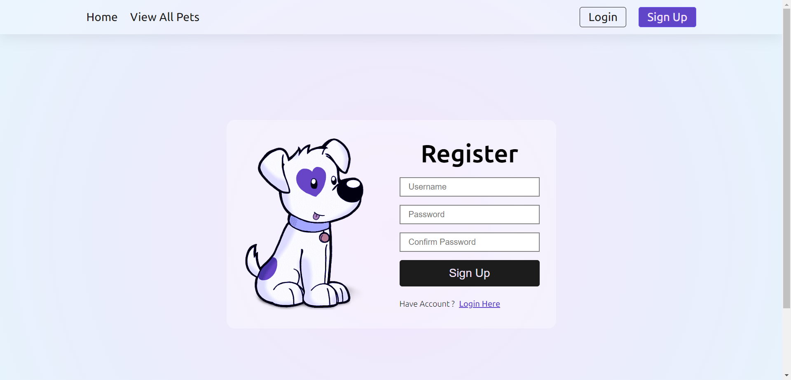
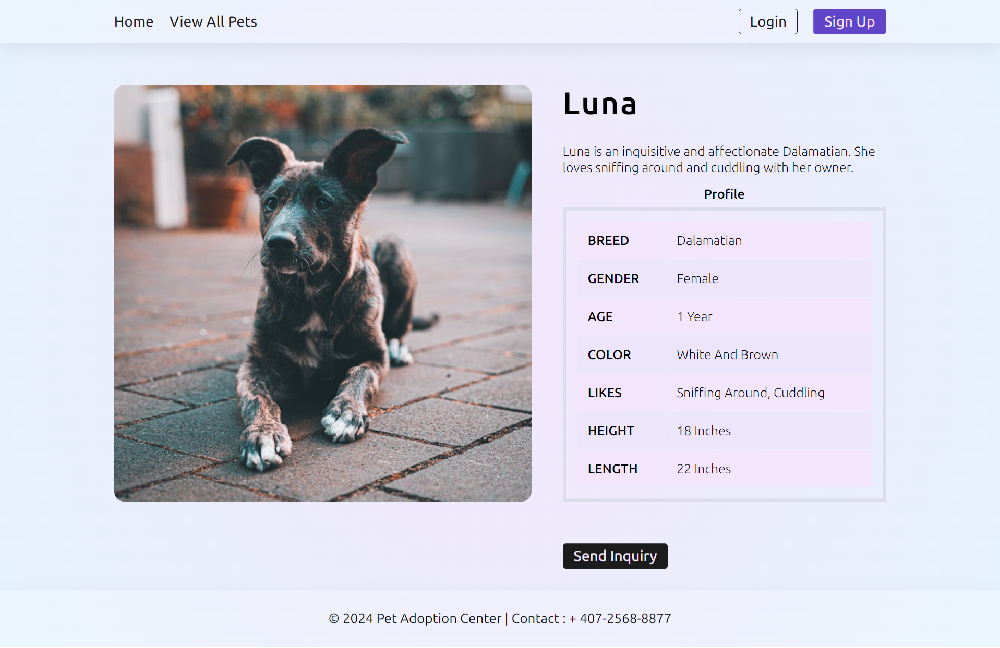

## Dog Adoption Listing Website

The App lists the available dogs profile for adoption. It is a total
5 Page application including Homepage, Listing Page, Login Page, Sign Up Page
and Listing Details Page.

## Features

- View all available dogs for adoption
- Filter dogs by breed, age, and gender
- View detailed information about each dog
- Users can actually register and log in and logout as well.

## Technical Specifications

- **Frontend**: HTML, CSS, JavaScript
- **JavaScript Libraries**: None (Vanilla JavaScript)
- **CSS Framework**: None (Custom CSS)
- **Others**: LocalStorage, Css Grid, Css FlexBox.

## File Structure

## Homepage
Navigate to the home page to see an overview of the website.
Have a hero section, followed by a randomly listed 4 listing that changes each time page reloads.
clicking on each listing items takes to a details page where it displays all details related to that listing.
View more button takes to the actual listing page. 
Have small section just to display other informations related to page.

## Listing Page
Use the filter form to narrow down the list of dogs by breed, age, or gender.
Listing all pets on this page where user can filter by breed, age and gender. As well as user can reset the filter to default.
Clicking on each card takes to the individual details page

## Login Page
User can actually login here if they are already registered.
If user exists, they are saved at localstorage as current logged in user and current logged in users name and logout button is visible at menu
replacing the login and register button.
if user logs out user will be redirected to login page and, menu will be set to its original form and login and register buttons are visible.

## Menu After User Login

## Register Page
 User can register and validations are made before users are actually registered.
 Password validations are made and each password must have at least 1 number and a special character.
 Confirm password before registering.
Registered users are saved on localstorage.

## Details page
Details page for each listing post where image, description and other infos are displayed in table.

